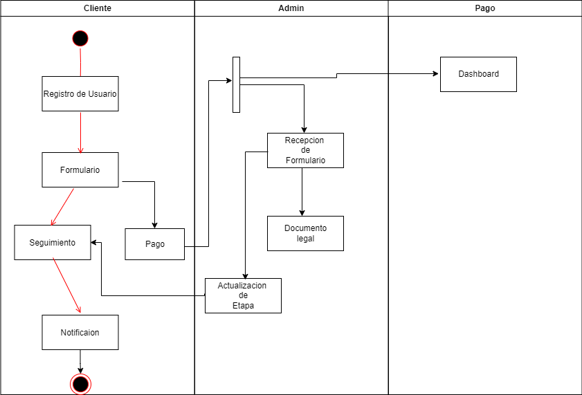
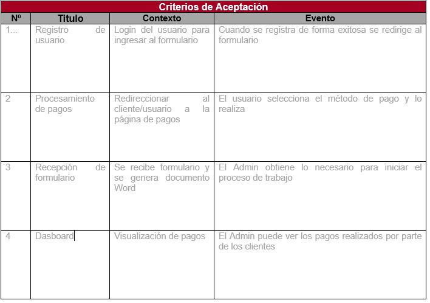
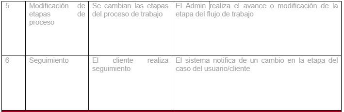

# Requerimientos

## 1. DESCRIPCION GENERAL DEL REQUERIMIENTO

PROYECTO: Abogabot

Nombre Requerimiento: Abogabot

Fecha Solicitud: 16/02/2022

Responsable(s) Solicitud: Luis Humberto Torres Escogido

Dependencia(s) Solicitante: Diseño Front-End

Responsable Funcional designado por el equipo de desarrollo de software: Luis Humberto Torres Escogido

## 2. FASE DE FORMALIZACIÓN

Descripción de la Solicitud

Usuario Solicitante
1-. Es un despacho de abogados que quiere automatizar las demandas de sus clientes, esto lo harán a través de una página web llenando un formulario.

2-. Al momento de llenar el formulario se manda al proceso de pago para finalizar la transacción.

3-. Para dar seguimiento a su demanda, el cliente crea una cuenta en la plataforma y verá el seguimiento de cada una de las actualizaciones del proceso legal.

4-. El administrador del sitio recibe la notificación de una nueva demanda y con los datos llenados del formulario se crea automáticamente el documento legal en formato word para empezar el proceso.

5-. El administrador recibe el pago y debe de ser capaz de verlo en un dashboard para ver la cantidad de ingresos recibidos.

6-. El administrador actualiza el proceso de la demanda y agrega comentarios en cada paso del proceso.

7-. Al usuario le llegan correos de notificación para saber el avance de su proceso.

8-. La página debe de ser responsive para poderla ver desde el celular.

9-. La preferencia de colores del cliente es azul marino y blanco, pero acepta propuestas.

Líder Funcional

1-	Automatizar la recepción de trabajo

2-	Llenar formulario y se habilita botón de pago

3-	LogIn y registro de usuarios externos

4-	Lo ingresado en el formulario se envía al admin y se genera un Word para    iniciar el proceso

5-	Validación de pagos en dasboard

6-	Cambio de etapas de proceso de la demanda y agrega comentarios

7-	Notificaciones personalizadas al cliente

8-	Pagina responsive

9-.  Preferentemente azul marino y blanco

## Alcance de la solución 
Se incluye:
1-. LogIn usuarios
2., Procesamiento de pagos
3-. Seguimiento por parte del Cliente
4-. Actualización de etapas por parte del Admin
5-. Dasboard para seguimiento de pagos
6-. Notificaciones al cliente

## Característica/Funcionalidad

Es un despacho de abogados que quiere automatizar las demandas de sus clientes, esto lo harán a través de una página web llenando un formulario.

Al momento de llenar el formulario se manda al proceso de pago para finalizar la transacción.

Para dar seguimiento a su demanda, el cliente crea una cuenta en la plataforma y verá el seguimiento de cada una de las actualizaciones del proceso legal.

El administrador del sitio recibe la notificación de una nueva demanda y con los datos llenados del formulario se crea automaticamente el documento legal en formato word para empezar el proceso.

El administrador recibe el pago y debe de ser capaz de verlo en un dashboard para ver la cantidad de ingresos recibidos.

El administrador actualiza el proceso de la demanda y agrega comentarios en cada paso del proceso.

Al usuario le llegan correos de notificación para saber el avance de su proceso.

La página debe de ser responsive para poderla ver desde el celular.

La preferncia de colores del cliente es azul marino y blanco, pero acepta propuestas.

## Razón/Resultado

Con la finalidad de ser más eficiente en la toma de casos y comunicación con el cliente.

## Criterios de Aceptación

## Vista Lógica

